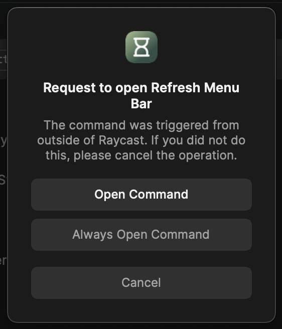

# Simple Timer

Simple countdown timer for Raycast.

_Solution is inspired by [timers-for-raycast](https://github.com/ThatNerdSquared/timers-for-raycast) but it's much simpler and easier to use than the former._

It allows to set one countdown timer using a Raycast command passing human-readable time input. Optionally active timer can be visible in the system menu bar with a simple UI to stop it or start another one.

## Commands

- **Start Timer** - start the countdown timer passing time input (see examples below)
- **Stop Timer** - stop the active timer

## Example time input formats

- `1h 20m`, `1h20m`, `1h 20min`, `1:20` → 1 hour 20 minutes
- `1h`, `1:00`, `1:` → 1 hour
- `20min`, `20m`, `0:20`, `:20`, `20` → 20 minutes

## Menu Bar refreshing

If you are using an optional menu bar for this extension, make sure to click "Always Open Command" when this confirmation alert appears. This allows the extension to update the menu bar state precisely at the time when the timer finishes.



## Usage

```sh
# install dependencies
npm install

# start the extension in development mode
# this command also imports the extension to Raycast
npm run dev
```

After successful extension build press `⌃` `C` to stop dev server. The extension stays in Raycast.
